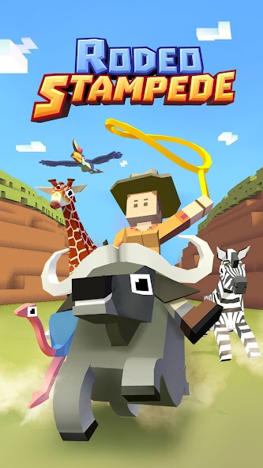
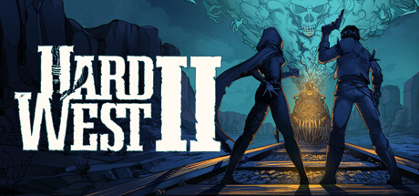

# Cowboy Safari Fan Hub

<p align="center">
  
</p>

Independent Cowboy Safari fan-site built with Next.js 16 (App Router) that prioritises instant iframe play, telemetry transparency, and parent-ready guidance. The project ships with long-form editorial content, structured data, and curated recommendations so it can outrank generic aggregator pages on Google for the query “cowboy safari”.

---

## TL;DR

| Area | Highlights |
| ---- | ---------- |
| **Instant play** | Hero iframe loads above the fold with fullscreen/share icons, controller tips, and telemetry pills. |
| **Content depth** | 800+ words on the homepage, evergreen `/guides`, and a `/support` desk with parent-mode FAQs. |
| **SEO** | JSON-LD for `VideoGame`, `SoftwareApplication`, `FAQPage`, `ItemList`, `BreadcrumbList`, plus tuned titles/descriptions. |
| **Zero ads** | No third-party scripts beyond the azgames.io iframe; CTA buttons route to guides/support/download mirrors. |
| **Design system** | Desert-inspired palette, custom header/footer, textured recommendation cards with real key art. |

---

## Visual Peek

<table>
  <tr>
    <td align="center">
      
      <p><strong>Related title cards</strong><br/>Real storefront art replaces placeholder gradients.</p>
    </td>
    <td align="center">
      
      <p><strong>Skills-first recommendations</strong><br/>Each card calls out the Cowboy Safari skill it reinforces.</p>
    </td>
  </tr>
  <tr>
    <td align="center">
      
      <p><strong>Steam-friendly imagery</strong><br/>Local assets keep SERP thumbnails sharp.</p>
    </td>
    <td align="center">
      
      <p><strong>Consistent palette</strong><br/>Desert copper + adobe neutrals across modules.</p>
    </td>
  </tr>
</table>

---

## Architecture Overview

- **Framework**: Next.js 16 App Router + React 19, TypeScript, Tailwind CSS v4 (`@tailwindcss/postcss`).
- **Layout**: Global header/footer, skip link, and typography tokens defined in `app/layout.tsx` + `app/globals.css`.
- **Content**:
  - `/` – hero iframe (`components/hero-play-panel.tsx`), editorial folds, timeline, FAQ, and image-rich recommendations.
  - `/guides` – long-form articles authored inside `app/guides/page.tsx` with computed word counts for schema accuracy.
  - `/support` – trust center with SLAs, hotline blocks, and parent-focused FAQs.
- **Data sources**: `lib/site-config.ts` for global metadata and `data/recommendations.ts` for cards.
- **SEO**: `app/robots.ts`, `app/sitemap.ts`, canonical alternates per route, and multi-type JSON-LD injected via `<Script>`.

---

## Getting Started

```bash
pnpm install      # or npm install
pnpm dev          # start local server on http://localhost:3000
pnpm lint         # run ESLint (Next.js config)
pnpm build        # production build with type checking
pnpm start        # serve .next/standalone output
```

> Minimum Node.js: 18.18+. The repo uses pnpm lock formatting, but npm/yarn work as well.

---

## Content Editing Cheatsheet

| Section | File | Notes |
| ------- | ---- | ----- |
| Hero copy, telemetry pills | `components/hero-play-panel.tsx` | Update `controlMappings`, `downloadCards`, or `infoPills`. |
| Site-wide strings & links | `lib/site-config.ts` | One source for domains, email, version number, download URLs. |
| Recommendation cards | `data/recommendations.ts` + `public/related-*.jpg` | Each entry now expects `platform`, `image`, `imageAlt`. |
| Guides | `app/guides/page.tsx` | Append to the `guides` array; schema word counts auto-update. |
| Support FAQ | `app/support/page.tsx` | Edit `supportFaq`, `commitments`, or `statusBoard`. |

---

## SERP & CTR Enhancements

- Titles aim for 40–60 characters; descriptions hover around 150 characters with clear value props (“zero ad instant play”).
- Added `robots` hints (maxSnippet/image preview) to encourage larger SERP cards.
- Breadcrumb JSON-LD for every route to unlock sitelinks.
- Recommendation art stored locally to prevent hotlink 404s and to ensure Open Graph previews always find a hero image.
- `public/logo.png` now powers the favicon (`app/favicon.ico`) to keep browser tabs + SERP favicons on brand.

---

## Deployment Notes

1. **Env** – none needed; all data lives in config files.
2. **Hosting** – Next.js 16 works on Vercel, Netlify, Fly.io, or any Node runtime with `pnpm build && pnpm start`.
3. **Cache strategy** – enable edge caching/CDN for `/`, `/guides`, `/support`; the iframe source is external and already optimized.
4. **Monitoring hooks** – hook GA4/Looker custom events to the `dataLayer.push` calls inside `HeroPlayPanel` for iframe views & CTA clicks.
5. **Image care** – drop new recommendation art into `public/` and update the corresponding entry in `data/recommendations.ts`.

---

## License & Attribution

This codebase inherits the default Next.js MIT template. All Cowboy Safari copy/images are provided for fan-site purposes—replace or credit the original publishers if you use the repo commercially.

